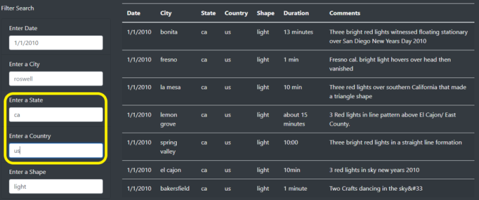

# UFO Sightings Website

## Project Overview

Our Client has asked us to take an existing UFO website that performs searches based on a single criteria and expand it to filter on multiple criteria. This requires that we redesign the filter panel by adding four additional attributes to filter on the UFO sightings data. The searches will be based on an "inclusive-and" where only those filters that have a value will be part of the result. This project will allow us to expand on the website features by adding additional filters and providing users with an expanded abilty to perform more granular searches on reported UFO sightings.

- Deliverables:
  1. Design a new panel with multiple attribute filtering
  2. Analysis and User documentation
  3. Summary and Recommendations for future changes
------------------------------------------------------------------------------------------------------------

## Resources
- Software: Visual Studio Code 1.56.2, JavaScript shell inside VS Code
- Browser : Google Chrome v91.0.4472.124 
- Libraries: Bootstrap v4.0, d3 v4.11.0 
------------------------------------------------------------------------------------------------------------

## Results

- As you can see from the screen capture below we were able to increase the filtering panel to 5 attributes as requested by the client. Each attribute allows for more granular drill down of the data by executing the filtered search of each filter entered. By default there are 'placeholder' values shown for each attribute that allows the website user to clearly understand what needs to be entered for each filter.

### How to perform Searches

1. You can search for all values or a single attribute based on the filter panel from the website. To use the filter panel, have a look at the full data on the right of the panel and enter an appropriate value in each filter as your search requires. 
2. Once all filter values have been entered, hit the "Enter" key on your keyboard to execute a search on the UFO data and have the updated results displayed to the right. 

- Below you can see an example where values are entered for 'state = ca and country = us', this is outlined with the yellow box and the filtered search of values is displayed to the right.

------------------------------------------------------------------------------------------------------------

## Summary Analysis

- The display results have generally met the deliverables and the site performed as expected. We can filter on one item up to and including 5 items as shown above. Recommendations of additional features are made below based on meeting the deliverables requested by the client. Additional filterers and features can be added using the framework encompassed in this design to improve the site further.

### Drawbacks

  1. Once we have performed a filtering action the data remains as shown and the only way to reset the table data is to refresh the screen.
  2. It would be advisible to remove the placeholder values once a filtered search has been completed. The placeholder values remaining on the filters "not" used is a bit misleading when looking at the results.

### Recommendations for website

  1. Add a button to the filter panel, perhaps near the "Filter Search" label that will reload the table data allowing for a new filtering action to start.
  2. Based on the filtered data result, it would be great to be able to chart/graph the result for a visual representation.
  3. A submit button would also be beneficial to be able to use the mouse to execute a filtered search.